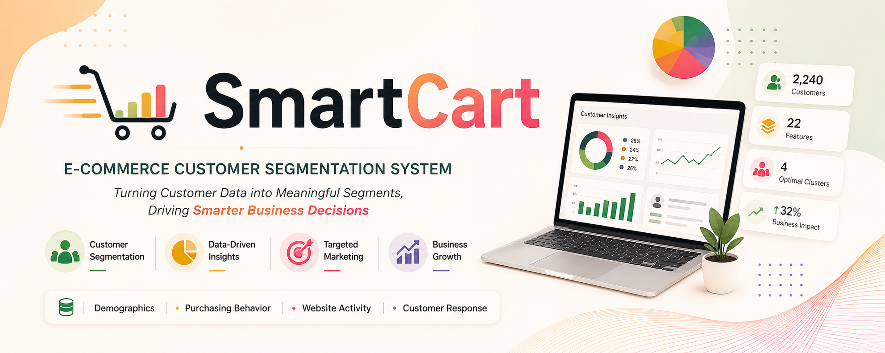
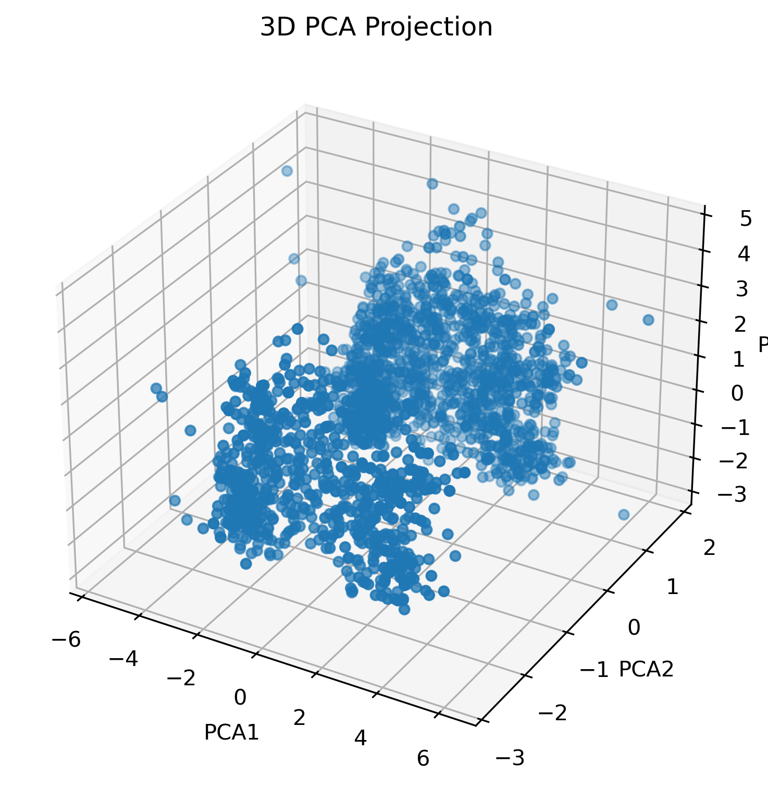
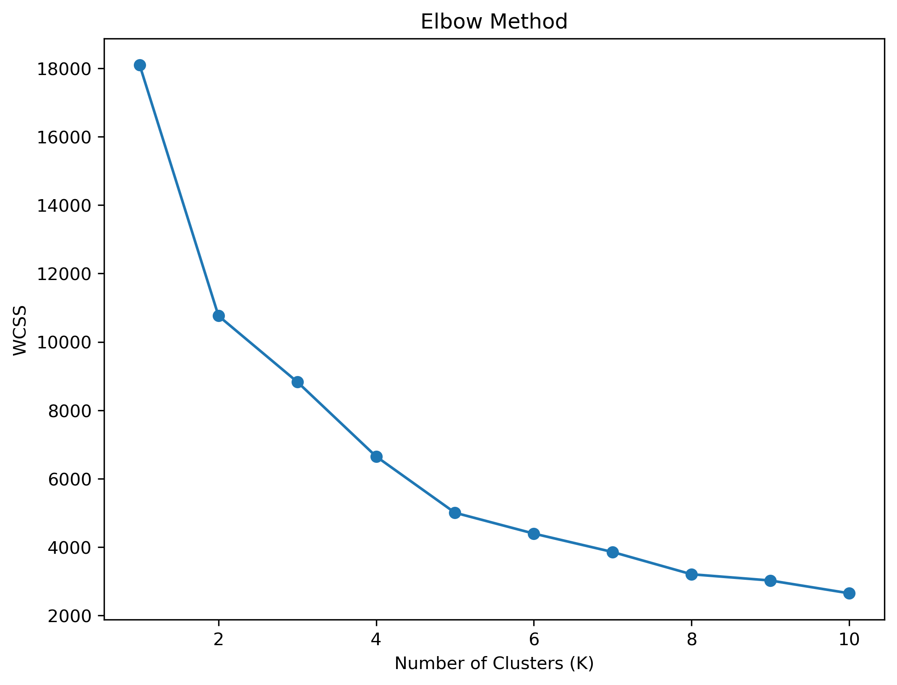
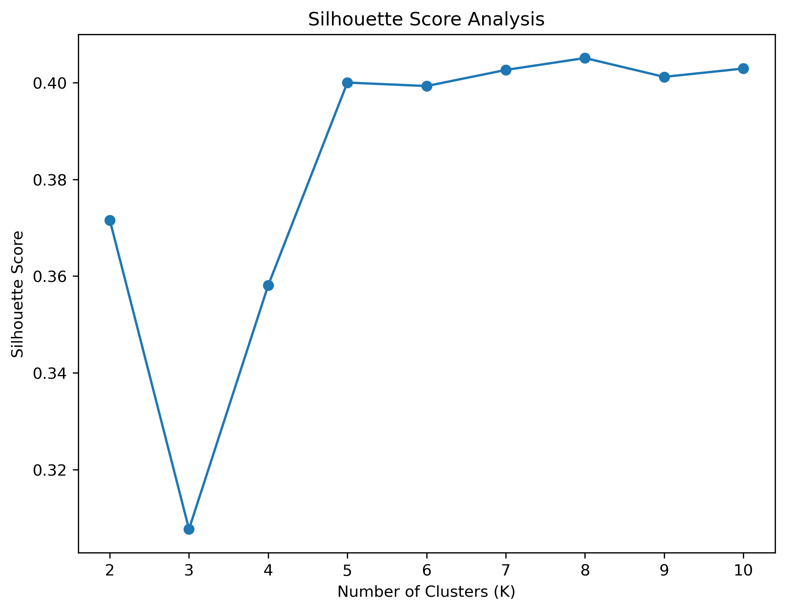
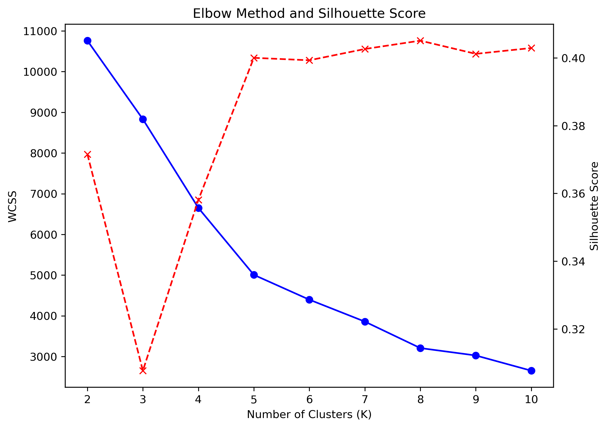
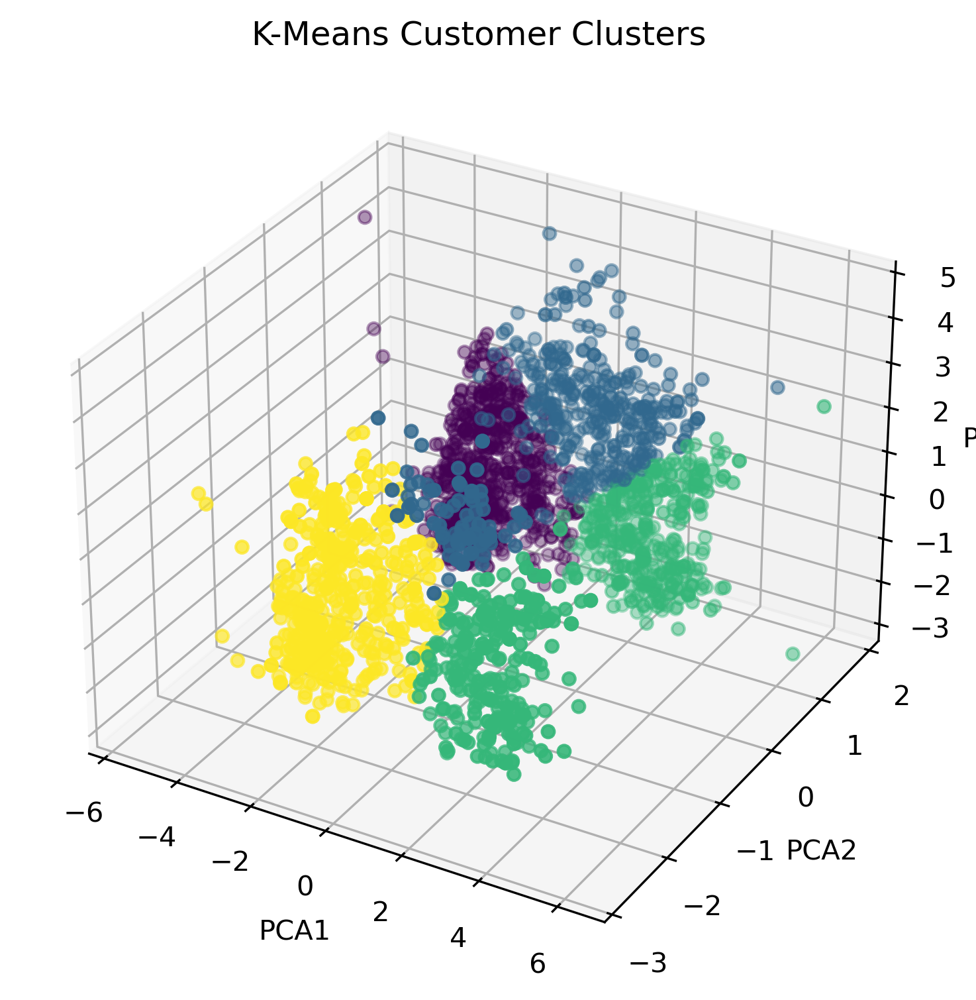
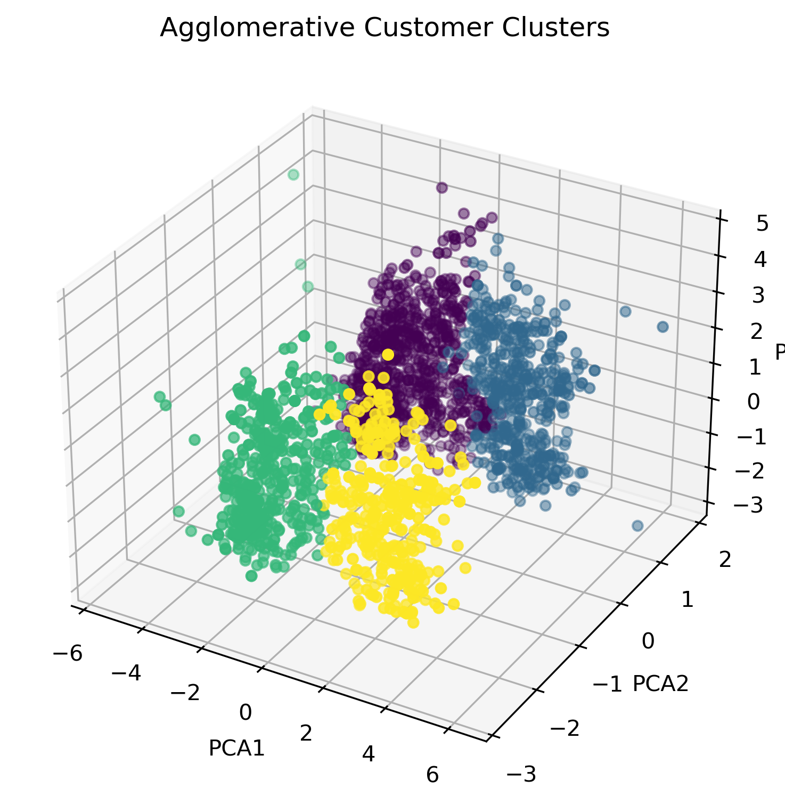

<!-- ========================= BANNER ========================= -->
<p align="center">
  
</p>


---

## 📌 Problem Statement

SmartCart is a growing e-commerce platform with **2240 customers and 22 features**, including demographics, purchasing behavior, and engagement data. 

Currently, the platform uses **generic marketing strategies**, leading to:
-  Inefficient marketing campaigns  
-  Poor customer retention  
-  Inability to identify high-value or churn-prone customers  

👉 **Goal:**  
Build an **AI-powered customer segmentation system** using **unsupervised machine learning** to group customers into meaningful clusters. 

---
# 🔄 Workflow

```text
Customer Dataset
       ↓
Data Cleaning
       ↓
Feature Engineering
       ↓
Outlier Removal
       ↓
Categorical Encoding
       ↓
Feature Scaling
       ↓
PCA Dimensionality Reduction
       ↓
Cluster Evaluation
       ↓
K-Means Clustering
       ↓
Agglomerative Clustering
       ↓
Customer Segmentation
       ↓
Business Insights
```


## 🎯 Objectives

- 🔍 Discover hidden patterns in customer behavior  
- 👥 Segment customers into meaningful groups  
- 📈 Improve marketing strategies  
- 💡 Enable data-driven decision making  
- 🎯 Identify high-value & churn-risk customers  

---

## 📂 Dataset Overview

Each row represents a **customer profile** with multiple attributes:

### 👤 Customer Demographics
- Year_Birth  
- Education  
- Marital_Status  
- Income  
- Kidhome, Teenhome  
- Dt_Customer  

### 🛍️ Purchase Behavior (Spending)
- MntWines  
- MntFruits  
- MntMeatProducts  
- MntFishProducts  
- MntSweetProducts  
- MntGoldProds  

### 🔁 Purchase Frequency
- NumDealsPurchases  
- NumWebPurchases  
- NumCatalogPurchases  
- NumStorePurchases  
- NumWebVisitsMonth  

### 📊 Customer Feedback
- Recency (days since last purchase)  
- Complain (0/1)  

---

## ⚙️ Tech Stack

- 🐍 Python  
- 📊 Pandas, NumPy  
- 📈 Matplotlib, Seaborn  
- 🤖 Scikit-learn  
- 📒 Jupyter Notebook  

---
# ⚙️ Feature Engineering

Several new features were created to better understand customer behaviour.

- **Age** – calculated from year of birth
- **Customer Tenure** – number of days since the customer joined SmartCart
- **Total Spending** – total amount spent across product categories
- **Total Children** – combined number of children and teenagers
- **Living With** – grouped customers into `Alone` and `Partner`
- **Education** – simplified education categories

---
# 📊 Data Analysis & Model Evaluation

## 🔍 Pairplot (Feature Relationships)

<p align="center">
  
</p>

**Insights:**
- Strong relationships between spending categories  
- High spenders buy across multiple categories  
- Clear grouping patterns exist  

---

## 🔥 Correlation Heatmap

<p align="center">
  
</p>

**Insights:**
- Spending features are positively correlated  
- Income strongly impacts spending  
- Useful for feature selection  

---

## 🧠 PCA 3D Projection

<p align="center">
  
</p>

**Insights:**
- Reduced high-dimensional data to 3D  
- Visible cluster separation  
- Confirms clustering possibility  

---

## 📉 Elbow Method (WCSS)

<p align="center">
  
</p>

**Insights:**
- Optimal clusters at **K = 4**  
- Avoids overfitting  

---

## 📊 Silhouette Score

<p align="center">
  
</p>

**Insights:**
- Measures cluster quality  
- Higher score → better clustering  

---

## 📊 Elbow + Silhouette Combined

<p align="center">
  
</p>

**Insights:**
- Confirms optimal K = 4  
- Strong validation  

---

## 🤖 K-Means 3D Clusters

<p align="center">
  
</p>

**Insights:**
- Clear separation of customer segments  
- High interpretability  

---

## 🔵 Agglomerative Clustering

<p align="center">
  
</p>

**Insights:**
- Alternative clustering method  
- Similar results → robust model  

---

## 📊 Cluster Distribution

<p align="center">
  
</p>

**Insights:**
- Balanced clusters  
- No bias toward any group  

---

## 💰 Income vs Spending

<p align="center">
  
</p>

**Insights:**
- Higher income → higher spending trend  
- Some anomalies exist  
- Helps identify premium customers  

---
# 📊 Cluster Insights

| Cluster | Description |
|--------|------------|
| 🟢 Cluster 0 | High-value customers |
| 🔵 Cluster 1 | Moderate spenders |
| 🟡 Cluster 2 | Low engagement |
| 🔴 Cluster 3 | Churn risk |
# 🏆 Final Results

The final outcome of the SmartCart project is a **4-segment customer classification** based on customer behaviour.

The final customer profiles identified in the analysis are:

### 🔴 Cluster 0 — Family / Discount-Oriented Customers

- More children
- Lower spending
- Partner households
- Higher website visits
- More price-sensitive behaviour

### 🔵 Cluster 1 — High-Value Customers

- High income
- High spending
- Strong purchasing behaviour
- Valuable customer segment

### 🟡 Cluster 2 — Lower-Value Customers

- Low income
- Low spending
- Lower overall customer value
- Suitable for targeted engagement strategies

### 🟢 Cluster 3 — High-Value / Premium Customers

- High income
- High spending
- Strong purchasing behaviour
- Represents an important premium customer segment
  # 💡 Business Impact

-  Personalized marketing  
-  Increased revenue  
-  Better customer retention  
-  Data-driven decisions

  # 👩‍💻 Author

**Akash Dukare**

Electronics & Communication Engineering Student

**Skills:** Python | AI/ML | Data Analytics

---

